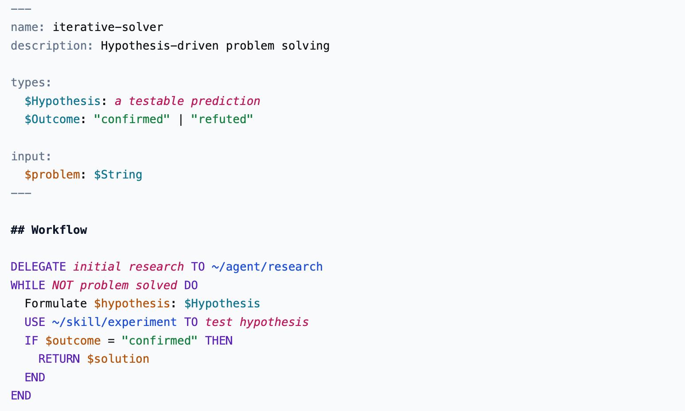

<a href="https://mdz.notation.dev"></a>

A superset of Markdown designed to exploit LLMs' ability to evaluate programs.

## Examples

Map-reduce is a classic diverge and converge pattern. It takes a list of items, spawns sub-agents transform each of those items, and then spawns one more sub agent to pick the best transformation. 

This can be expressed as a _higher-order_ skill, meaning the general diverge and converge behaviour becomes programmable by using this skill with different inputs.

```ruby
---
name: map-reduce
input: $items, $map, $map-worker, $reduce, $reduce-worker, $scratch
---

IF $scratch THEN
  Instruct sub agents to write their outputs into a scratch folder
ELSE
  Instruct sub agents to return the output in their response
END

FOR $item IN $items
  SPAWN $map-worker
  WITH
    instruction: $map
    item: $item
END

RETURN SPAWN $reduce-worker
WITH
  instruction: $reduce
  results: every sub-agent output, in the same order as $items
```

This can be compsed in many different ways. Let's take the example of a **simplify** skill:

```ruby
---
name: simplify
input: $file, $n
---

$heuristics = ["making it more direct", "making it more obvious", "making it smaller"]
$candidate: string @(./candidate-{filename}) = a copy of $file

RETURN USE skills/map-reduce
  WITH
    items: $heuristics
    map: Simplify $candidate by $item.
    reduce: Pick the candidate that most improves the code.
    map-worker: sonnet
    reduce-worker: sonnet
    scratch: true
```

And that composed skill can be called by prompting:

```ruby
USE skills/simplify.mdz WITH
  $file: complex-module.java
  $n: 3
```

## Research

So, does the language work, and is it useful in the real world?

Yes, and maybe.

I ran a limited number of experiements in [./research](./research). The core findings so far are that:

1. Agents understand and follow MDZ with minimal explanation. They can throw errors if the language is malformed or there are type errors. It is exteremly expressive – as long as you are cohernet, you can make up syntax on the fly, and models will interpret it in a predictable way.
2. MDZ itself does not make a model perform any better. It's entirely down to the programs written with it.
3. MDZ does allow you to describe more advanced orchestration programs, and those programs may  or may not perform better than a simple prompt.
4. MDZ programs structurally similar to a ralph loop (e.g. hill-climbing) deliver equivalent performance a ralph loop with the same optimisation goal.
5. Advanced MDZ programs (such as a higher order map-reduce skill) require opus-level models to orchestrate faithfully (they can ofc delegate work to less capable models).
6. Models do not zero-shot good MDZ programs.

Utlimately, MDZ is a way to concisely express agent behaviours. It does not make the model perform better. If you like reading code, you may like reading MDZ over prose. Its most useful property is composition.

## Language

### Goals

The language is designed to be:

- Readable as natural prose
- Unconstrained by deterministic paradigms
- Parseable by deterministic tools (for syntax highlighting, quality checks, observability etc.)
- Interpretable by LLMs as executable instructions
- Composable through references to sub-agents and skills

### Syntax

MDZ is "prose first", meaning that you write prompts as normal, and use MDZ keywords to opt-in to programmatic control flow. 

The language is very flexible about mixing prose and programmatic statements (reflecting LLMs' ability to interpret and contextualise instructions).


  
To disambiguate from regular prose, the language leans on all-caps keywords. These notify a contractual obligation.

To provide clarity to LLMs, MDZ uses the `END` keyword to delimit blocks. MDZ is indentation insensitive.

## Language Design

Under the hood, a .md or .mdz file parsed with MDZ is an amalgam of two grammars: Markdown and MDZ.

MDZ is the grammar that adds LLM-interpretable programmatic constructs to a host grammar (e.g. markdown, plain text etc). The focus is on extending Markdown, but architecturally any document format can in theory be a host language.

The MDZ parser segments the document into a block stream containing:
- unparsed blocks belonging to the host grammar e.g. raw markdown strings
- blocks of proz AST nodes

MDZ kicks in when a delimiter like `FOR` or `SPAWN` is detected

In the case of MDZ, you end up with a block stream that looks like this:

```json
[
  { "type": "host", "text": "---\nname: example-doc\n---\n\n# MDZ" },
  {
    "type": "for",
    "target": "item",
    "iterable": "items",
    "blocks": [
      { "type": "host", "text": "prose inside for loop\n" },
      { "type": "stmt", "keyword": "CONTINUE" }
    ]
  }
]
```

## License

MIT License - Copyright (c) 2026 [Daniel Grant](https://danielgrant.co/)
